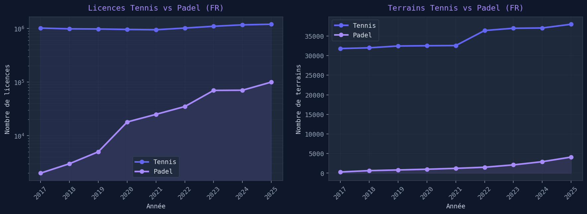
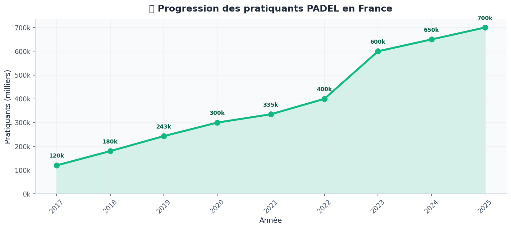
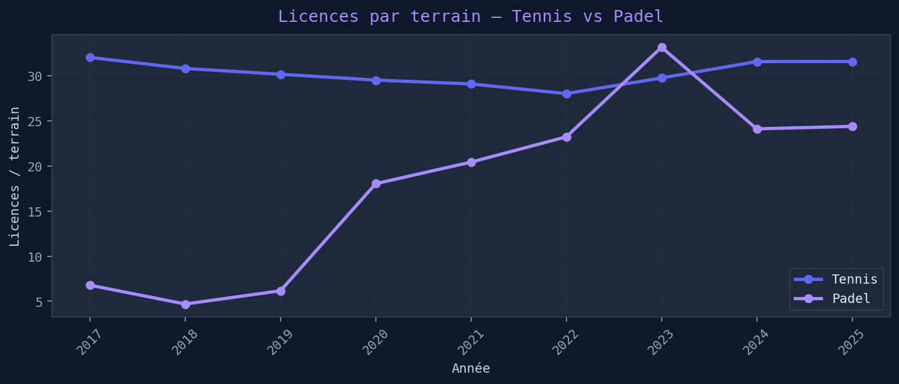
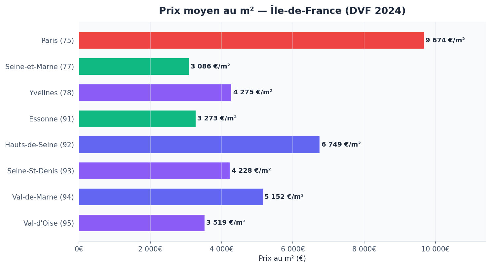

# 🎾 Analyse Immobilière & Sportive : Complexes de Padel & Tennis
**Projet Data Science - ECE Paris (ING4)**

## 📌 Présentation du Projet
Ce projet a pour objectif d'accompagner un investisseur immobilier dans le secteur du sport loisir. En exploitant les données foncières (DVF) et les bases de données d'équipements sportifs de **data.gouv.fr**, nous avons développé un outil d'aide à la décision sous forme de Notebook Jupyter interactif.

## 👤 Notre Persona : "Marc, l'Investisseur Sport-Loisir"
* **Profil :** Entrepreneur cherchant à investir dans des infrastructures sportives rentables.
* **Besoin principal :** Identifier les zones géographiques où la demande en Padel est forte mais l'offre foncière reste abordable.

### 📋 Les 10 Besoins de l'Investisseur :
1. Identifier les communes avec un faible ratio de terrains de Padel par habitant.
2. Comparer le prix moyen du m² (données DVF) par département.
3. Visualiser les zones de forte densité de population (potentiel client).
4. Analyser l'évolution historique des ventes immobilières dans les zones sportives.
5. Filtrer les opportunités par type de bien (terrain nu vs entrepôt à transformer).
6. Estimer le coût d'acquisition moyen selon la surface nécessaire pour 4 courts.
7. Repérer la concurrence existante (clubs de tennis municipaux et privés).
8. Évaluer l'attractivité économique régionale (revenu fiscal moyen).
9. Prédire les zones de gentrification favorables aux sports "premium" comme le Padel.
10. Simuler la rentabilité locative en fonction du prix d'achat du terrain.

## 🛠️ Méthodologie & Bibliothèques
* **Nettoyage (Pandas/Numpy) :** Gestion des valeurs manquantes et préparation des fichiers DVF.
* **Visualisation (Matplotlib) :** Création de graphiques d'évolution des prix et de répartition.
* **Interactivité (Ipywidgets) :** Mise en place de 10 widgets (simples, interactifs et complexes).

## 📊 Structure des Livrables
1.  **Preparation_Donnees.ipynb** : Notebook dédié au chargement et au nettoyage des données.
2.  **Application_Investisseur.ipynb** : Notebook interactif final pour le persona.
3.  **Data/** : Dossier contenant les fichiers CSV et TXT utilisés (hors sources brutes volumineuses).

## 📊 Visualisations

### Évolution des licences & terrains — Tennis vs Padel (France)

### Progression des pratiquants Padel en France

### Licences par terrain — Tennis vs Padel

### Prix au m² par département — Île-de-France (DVF 2024)

---

## 📂 Données utilisées

| Fichier | Description | Aperçu |
|---------|-------------|--------|
| [`dvf_communes_2024_idf.csv`](https://github.com/Kycks912004/projet-padel-tennis/blob/main/projet-padel-tennis-main/data/dvf_communes_2024_idf.csv) | Prix au m² par commune en Île-de-France (DVF 2024) | `insee_com`, `prix_m2_moyen`, `nb_mutations` |
| [`data_es_clean.csv`](https://github.com/Kycks912004/projet-padel-tennis/blob/main/projet-padel-tennis-main/data/data_es_clean.csv) | Équipements sportifs en France (type, commune, coordonnées GPS) | `Nom`, `Type`, `Longitude`, `Latitude` |
| [`lic_2022_tennis_idf.csv`](https://github.com/Kycks912004/projet-padel-tennis/blob/main/projet-padel-tennis-main/data/lic_2022_tennis_idf.csv) | Licenciés tennis Île-de-France 2022 par commune et tranche d'âge | `commune`, `total_f`, `total_h`, `total` |
| [`communes_france_clean.csv`](https://github.com/Kycks912004/projet-padel-tennis/blob/main/projet-padel-tennis-main/data/communes_france_clean.csv) | Données démographiques des communes (population, densité, région) | `population`, `densite`, `latitude_mairie` |
| [`geographie.csv`](https://github.com/Kycks912004/projet-padel-tennis/blob/main/projet-padel-tennis-main/data/geographie.csv) | Coordonnées GPS des terrains de tennis et padel | `commune`, `latitude`, `longitude`, `sport` |
| [`ChiffresPadelTennis.csv`](https://github.com/Kycks912004/projet-padel-tennis/blob/main/projet-padel-tennis-main/data/ChiffresPadelTennis.csv) | Évolution nationale licences & terrains Padel/Tennis (2017–) | `Annee`, `LicenceTennis_FR`, `Padel_FR` |

**Aperçu `ChiffresPadelTennis.csv` :**

| Année | Licences Tennis FR | Padel FR | Terrains Tennis | Terrains Padel |
|-------|--------------------|----------|----------------|----------------|
| 2017 | 1 018 721 | 120 000 | 31 805 | 295 |
| 2018 | 985 551 | 180 000 | 31 990 | 639 |

**Aperçu `dvf_communes_2024_idf.csv` :**

| insee_com | nb_mutations | prix_m2_moyen | surface_moy | dep_code |
|-----------|-------------|--------------|-------------|----------|
| 75056 | 24 246 | 9 674 € | 51 m² | 75 |
| 77001 | 17 | 2 956 € | 122 m² | 77 |

---

## 👥 Équipe de Projet
* **PINTO Kylian**
* **DAVIDSON Matt**
* **TOUVRON Erwan**
